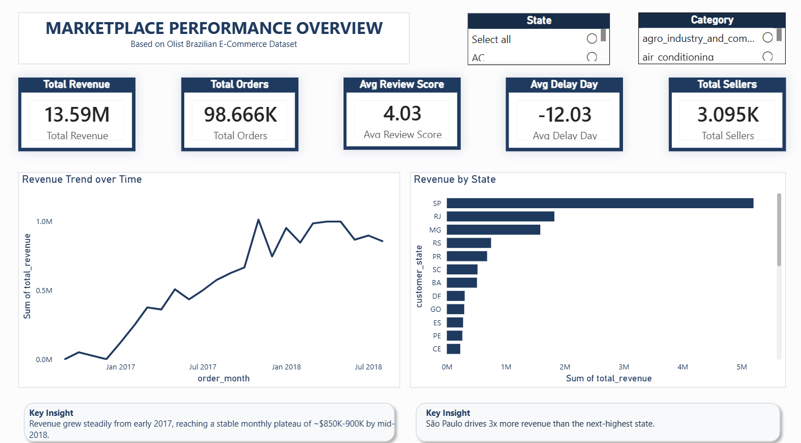
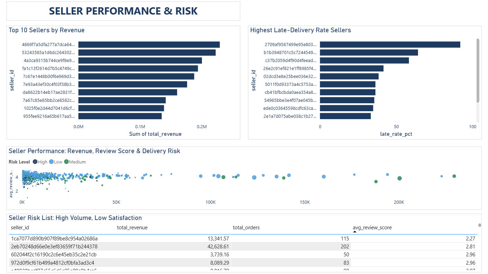
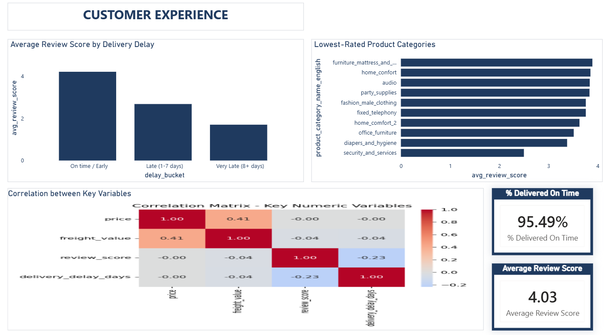
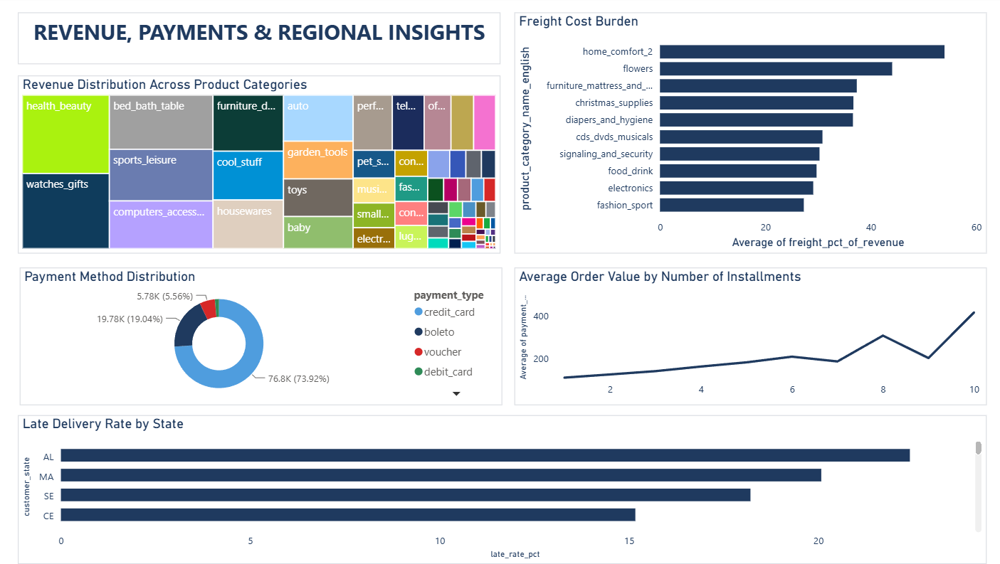

# Marketplace Seller Performance Analysis

**Improving Marketplace Performance Through Seller, Delivery, and Customer Behavior Analytics**

An end-to-end data analytics project (SQL → Python → Power BI) built on the Olist
Brazilian E-Commerce public dataset, analyzing seller performance, delivery
reliability, customer satisfaction, and regional trends to identify concrete,
actionable business recommendations.

> Full problem definition and research questions: [`Problem_Statement.md`](./Problem_Statement.md)

---

## Dashboard Preview

| Overview | Seller Performance & Risk |
|---|---|
|  |  |

| Customer Experience | Revenue, Payments & Regional |
|---|---|
|  |  |

---

## Tech Stack

- **Python** (pandas, seaborn, matplotlib) — data loading, cleaning, EDA
- **SQL** (SQLite, via Python/SQLAlchemy) — table exploration, joins, cleaning logic
- **Power BI Desktop** — 4-page interactive dashboard with DAX measures
- **Jupyter Notebooks** — full analysis walkthrough

---

## Project Structure

```
Marketplace-Seller-Performance-Analysis/
├── README.md
├── Problem_Statement.md
├── Dataset/                    # raw CSVs (gitignored — see Data Source below)
├── SQL/
│   └── data_cleaning.sql       # documented join & cleaning logic
├── Python/
│   ├── load_to_db.ipynb        # loads raw CSVs into SQLite (olist.db)
│   └── eda.ipynb               # full exploratory analysis, all 9 research questions
├── Dashboard/
│   └── Olist_Dashboard.pbix    # 4-page Power BI dashboard
├── Report/
│   └── Business_Report.pdf     # written findings & recommendations
└── Images/
    └── correlation_matrix.png  # + dashboard screenshots
```

---

## Data Source

This project uses the [Olist Brazilian E-Commerce Public Dataset](https://www.kaggle.com/datasets/olistbr/brazilian-ecommerce)
(Kaggle) — 9 relational tables covering ~100,000 real orders (2016-2018).

Raw CSVs are not committed to this repo (kept out via `.gitignore` to keep the
repo lightweight). To reproduce:
1. Download the dataset from the Kaggle link above
2. Place all 9 CSVs into `Dataset/`
3. Run `Python/load_to_db.ipynb` to build the local SQLite database
4. Run `Python/eda.ipynb` to reproduce the full analysis

---

## Key Findings

**Seller Performance**
- Top seller generated ~$229K in revenue across 1,132 orders; strategies vary — some
  sellers drive revenue through volume, others through higher-ticket items with fewer orders.
- One seller showed a **92% late-delivery rate** across 25 real orders — a genuine
  outlier flagged for audit.
- Seller order volume and late-delivery rate are essentially uncorrelated (r = 0.01) —
  delivery risk is spread across sellers of all sizes, not concentrated among small sellers.

**Customer Experience**
- Average review score drops sharply with delivery delay: **4.21 (on-time) → 2.68
  (1-7 days late) → 1.70 (8+ days late)**, confirmed by a -0.23 correlation between
  delay and review score.
- The lowest-rated categories (`security_and_services`, `diapers_and_hygiene`) show
  delivery times close to the dataset average — their low scores are driven by
  product/category factors, not logistics.

**Revenue & Cost**
- `christmas_supplies` and `signaling_and_security` carry the highest freight cost
  relative to revenue (~30-37%), an efficiency concern beyond just raw margin.
- Credit card is the dominant payment method (73.8%), followed by boleto (19.4%),
  a Brazil-specific bank-slip payment method.
- Average order value rises steadily with installment count (₹91 at 1 installment
  to ₹292 at 10), reflecting natural behavior of splitting larger purchases.

**Regional**
- São Paulo (SP) generates ~$5.2M in revenue — over 3x the next-highest state
  (Rio de Janeiro, ~$1.8M).
- Northeast states (AL, MA, SE, CE, PI) show the worst late-delivery rates
  (15-22%), likely reflecting distance from the São Paulo-centered seller base.
  Notably, Rio de Janeiro — a top-2 revenue state — also shows an above-average
  late rate (13.3%), a flag worth addressing given its revenue importance.

Full methodology, data cleaning decisions, and all 9 research questions are
documented in `Python/eda.ipynb` and `SQL/data_cleaning.sql`.

---

## Data Cleaning Highlights

- Deduplicated the geolocation table from 1,000,163 rows to 19,015 unique zip
  codes by averaging repeated GPS readings.
- Caught and fixed a join bug where duplicate review rows (547 orders had 2-3
  reviews each) were inflating the master table by ~0.6% — resolved using
  `ROW_NUMBER()` to keep only the most recent review per order.
- Identified that ~3% of orders never completed their lifecycle (canceled/
  unavailable), and excluded them from delivery-time calculations accordingly.

---

## Author

Diksha Sehrawat — built as an applied data analytics project combining SQL,
Python, and Power BI to demonstrate end-to-end analytical workflow, from raw
data to business recommendations.
